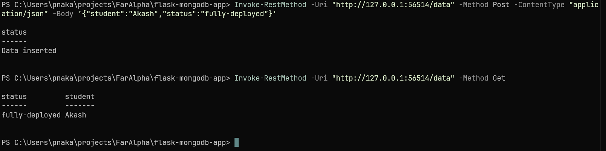
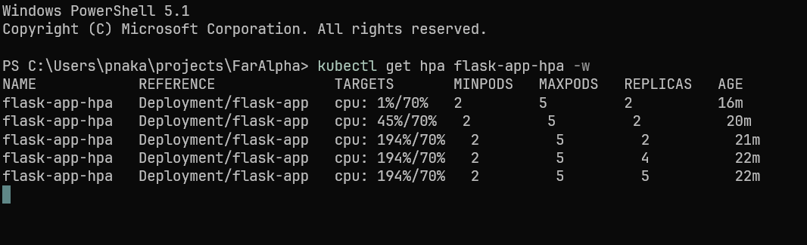
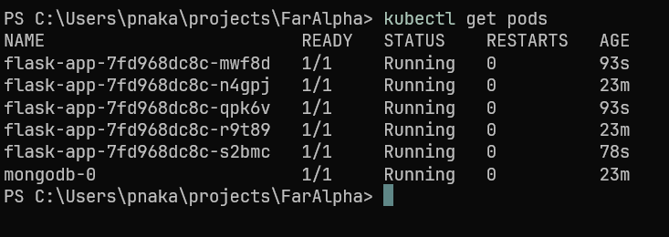

# Flask-MongoDB Stack on Kubernetes

A Python Flask microservice backed by an authenticated MongoDB database, orchestrated locally via Minikube with a Horizontal Pod Autoscaler (HPA) for traffic-driven scaling.

---

## Architecture

| Tier | Component | Details |
|---|---|---|
| Application | Flask (stateless) | 2 replicas baseline, scales to 5 |
| Database | MongoDB (stateful) | StatefulSet with local persistent volume |
| Secrets | Kubernetes Secrets | Credentials and connection URIs injected at runtime |
| Scaling | HPA | Monitors CPU; triggers scale-out at 70% threshold |

---

## Resource Limits

Both tiers share the same resource configuration:

```yaml
resources:
  requests:
    cpu: "200m"
    memory: "250Mi"
  limits:
    cpu: "500m"
    memory: "500Mi"
```

---

## Setup & Deployment

**1. Start the cluster and enable metrics:**

```powershell
minikube start --driver=docker
minikube addons enable metrics-server
```

**2. Point your shell at Minikube's Docker daemon:**

```powershell
minikube docker-env | Invoke-Expression
```

**3. Build the application image inside Minikube:**

```powershell
cd flask-mongodb-app
docker build -t flask-mongodb-app:v1 .
```

**4. Apply the Kubernetes manifests:**

```powershell
kubectl apply -f ./k8s/secrets.yaml
kubectl apply -f ./k8s/mongodb.yaml
kubectl apply -f ./k8s/flask-app.yaml
kubectl apply -f ./k8s/hpa.yaml
```

**5. Expose the service:**

```powershell
minikube service flask-service
```

---

## Verification

### Persistent Storage & API

Insert a record and retrieve it to confirm the Flask → MongoDB connection is live:



### HPA Under Load

Watch the autoscaler respond as CPU crosses the 70% threshold:

```powershell
kubectl get hpa flask-app-hpa -w
```



### Pod Status After Scale-Out

```powershell
kubectl get pods
```



All 5 Flask replicas running alongside the single MongoDB StatefulSet pod.
